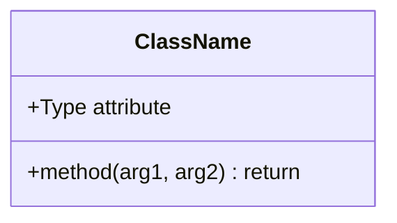
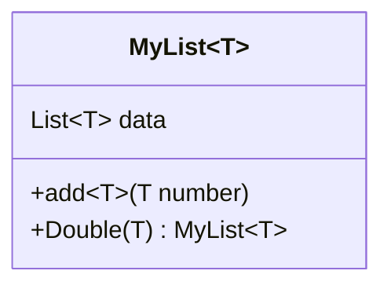
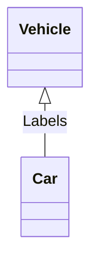
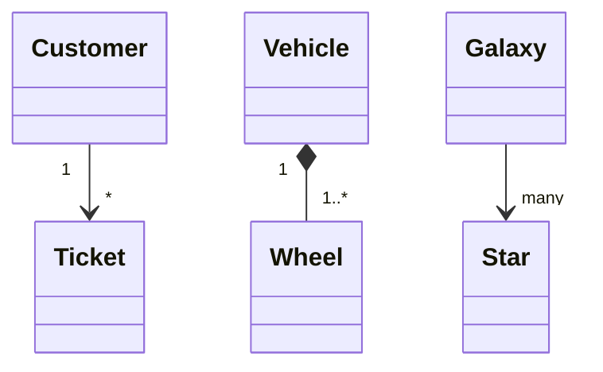
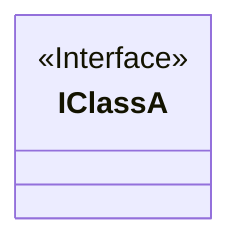
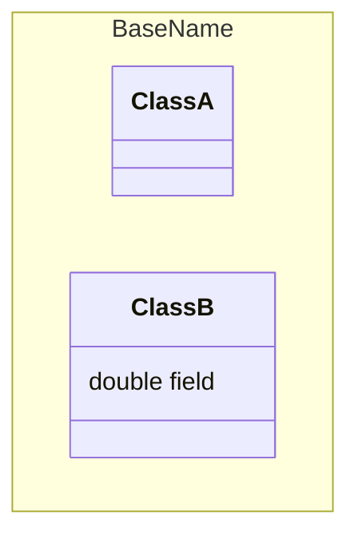
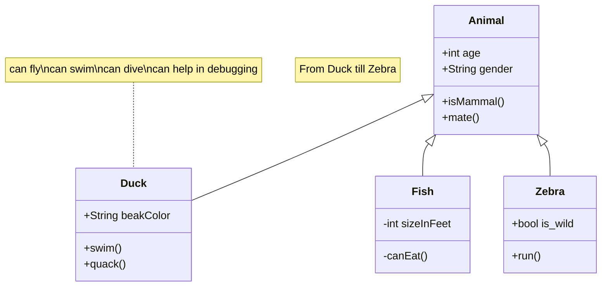

# Class diagrams
Refer: https://mermaid.js.org/syntax/classDiagram.html

The class diagram represents the classes and their relationships with UML notations.

## Comments
Comments using `%%` on their own line can be inserted within a class diagram, which will be ignored by the parser.
```
classDiagram
    %% This is a comment, not visible in the diagram.
    class ClassA
```

## Class Members
UML provides how to represetn class members such as **attributes** and **methods**.
Mermaid distinguishes between attributes and functions/methods based on whether `()` are present or not.
```
classDiagram
class ClassName
    ClassName : +Type attribute
    ClassName : +method(arg1, arg2) return
```
Insetead of writing the class name every time, group members of a class using `{}` brackets.
```
classDiagram
class ClassName {
    +Type attribute
    +method(arg1, arg2) return
}
```

These two ways output the same diagram.


### Generic Types
"Generic Types" such as `List<T>` can be represented by enclosing the type in `~` in fields, parameters, and return types.
```
classDiagram
class MyList~T~ {
    List~T~ data
    +add~T~(T number)
    +Double(T) MyList~T~
}
```


### Visibility
To describe the visilibity of a class member, use optional notation before the member name.
+ `+` public
+ `-` private
+ `#` protected
+ `~` package/internal

### Modifiers
To include modifiers/classifiers, use optional notation "after" the `()` or return type.
+ `*` Abstract
  + e.g.: `someAbstractMethod()*` or `someAbstractMethod() : void*`
+ `$` Static
  + (method) e.g.: `someStaticMethod()$` or `someStaticMethod() : void$`
  + (field) e.g.: `Type someStaticField$`

## Inheritance
When 'Car' class inherits from 'Vehicle' class, it is represented as follows:


### Relationships
Currently, Mermaid supports eight types of relations defined under UML.
+ `<|--` Inheritance
+ `*--` Composition
+ `o--` Aggregation (has-a)
+ `-->` Association
+ `--` Link(Solid)
+ `..>` Dependency
+ `..|>` Realization
+ `..` Link(Dashed)

### Cardinality/Multiplicity
Cardinality/Multiplicity can be represented by placing the optional text within `""` before or after a given arrow.


## Annotations of Class
It is possible to annotate classes with `<<text>>`.
Some common annotations are:
+ `<<Interface>>`
+ `<<Abstract>>`
+ `<<Service>>`
+ `<<Enumeration>>`
```
classDiagram
    class IClassA
    <<Interface>> IClassA
```
```
classDiagram
    class IClassA {
        <<Interface>>
    }
```



### Namespace
```
classDiagram
namespace BaseName {
    class ClassA
    class ClassB {
        double field
    }
}
```


## About
