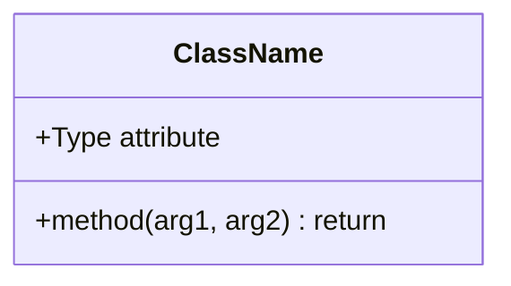
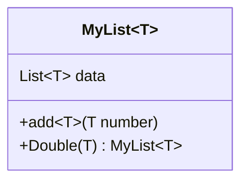
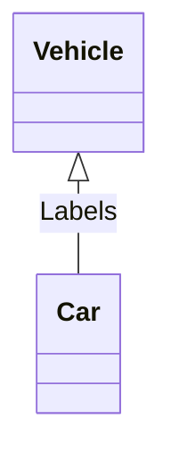
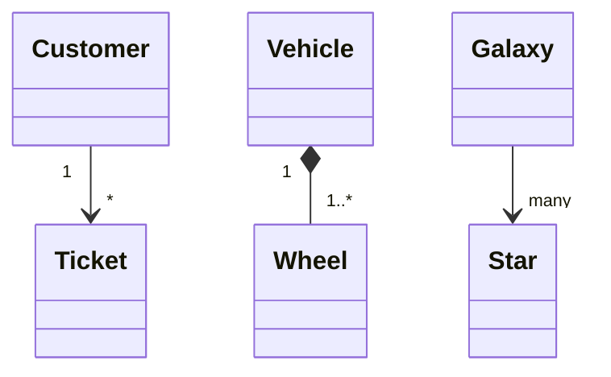
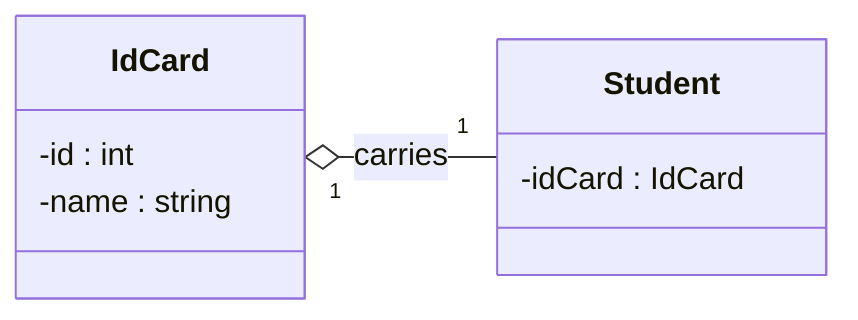
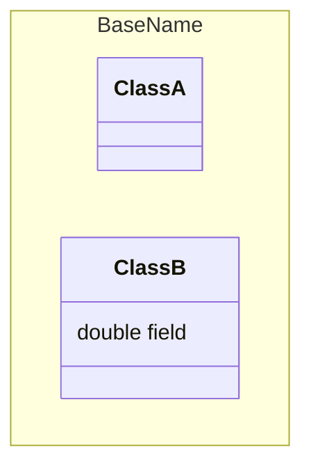
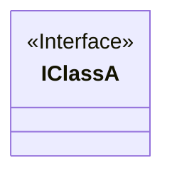
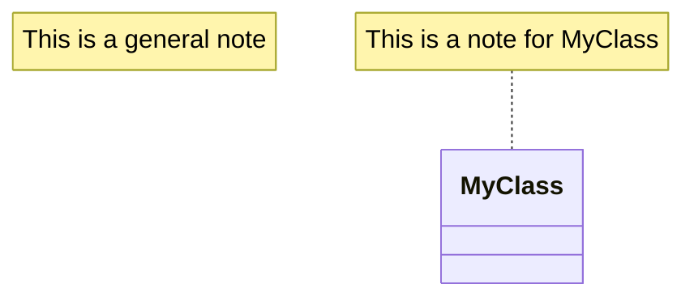
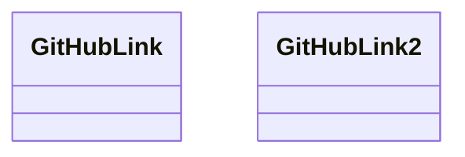
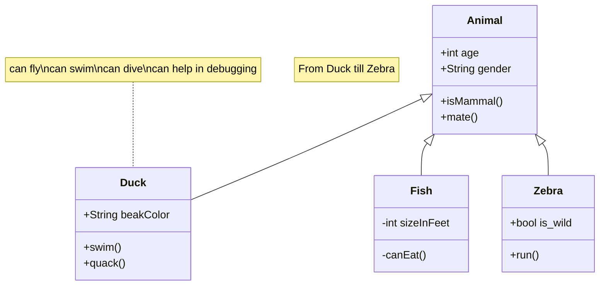

# Class diagrams
Refer: https://mermaid.js.org/syntax/classDiagram.html

The class diagram represents the classes and their relationships with UML notations.


## Class Members
UML provides how to represetn class members such as **attributes** and **methods**.
Mermaid distinguishes between attributes and functions/methods based on whether `()` are present or not.
```
classDiagram
class ClassName
    ClassName : +Type attribute
    ClassName : +method(arg1, arg2) return
```
Insetead of writing the class name every time, group members of a class using `{}` brackets.
```
classDiagram
class ClassName {
    +Type attribute
    +method(arg1, arg2) return
}
```

These two ways output the same diagram.


### Generic Types
"Generic Types" such as `List<T>` can be represented by enclosing the type in `~` in fields, parameters, and return types.
```
classDiagram
class MyList~T~ {
    List~T~ data
    +add~T~(T number)
    +Double(T) MyList~T~
}
```


### Visibility
To describe the visilibity of a class member, use optional notation before the member name.
+ `+` public
+ `-` private
+ `#` protected
+ `~` package/internal

### Modifiers
To include modifiers/classifiers, use optional notation "after" the `()` or return type.
+ `*` Abstract
  + e.g.: `someAbstractMethod()*` or `someAbstractMethod() : void*`
+ `$` Static
  + (method) e.g.: `someStaticMethod()$` or `someStaticMethod() : void$`
  + (field) e.g.: `Type someStaticField$`

## Inheritance
When 'Car' class inherits from 'Vehicle' class, it is represented as follows:


### Relationships
Currently, Mermaid supports eight types of relations defined under UML.
+ `<|--` Inheritance
+ `*--` Composition
+ `o--` Aggregation (has-a)
+ `-->` Association
+ `--` Link(Solid)
+ `..>` Dependency
+ `..|>` Realization
+ `..` Link(Dashed)

### Cardinality/Multiplicity
Cardinality/Multiplicity can be represented by placing the optional text within `""` before or after a given arrow.


### Direction of Arrows
The direction of class relationships can be changed by using the direction statement.
+ `direction RL` Right to Left
+ `direction LR` Left to Right
+ `direction TB` Top to Bottom
+ `direction BT` Bottom to Top

```
classDiagram
    direction RL
    %% direction TB
    class Student {
        -idCard : IdCard
    }
    class IdCard{
        -id : int
        -name : string
    }
    Student "1" --o "1" IdCard : carries
```


## Miscellaneous
### Namespace
*Unable to display in GitHub (on 2024.1.9)*
```
classDiagram
namespace BaseName {
    class ClassA
    class ClassB {
        double field
    }
}
```


### Annotations of Class
It is possible to annotate classes with `<<text>>`.
Some common annotations are:
+ `<<Interface>>`
+ `<<Abstract>>`
+ `<<Service>>`
+ `<<Enumeration>>`
```
classDiagram
    class IClassA
    <<Interface>> IClassA
```
```
classDiagram
    class IClassA {
        <<Interface>>
    }
```


### Comments
Comments using `%%` on their own line can be inserted within a class diagram, which will be ignored by the parser.
```
classDiagram
    %% This is a comment, not visible in the diagram.
    class ClassA
```

### Notes
A note can be added on the diagram or for a specific class.
```
classDiagram
    note "This is a general note"
    note for MyClass "This is a note for MyClass"
    class MyClass{
    }
```



## Interaction
It is possible to bind a click event to a node.
A click event can be defined with JavaScript function or a URL.

### URL Link
```
classDiagram
    class GitHubLink
    link GitHubLink "https://www.github.com" "This is a tooltip for the link"
    class GitHubLink2
    click GitHubLink2 href "https://www.github.com" "This is a tooltip for the link"
```


### JavaScript Callback (in HTML page)
Note: The callback functionality is disabled when using `securityLevel: 'strict'` and enable when using `securityLevel: 'loose'` in the configuration.
```html
<body>
  <pre class="mermaid">
    classDiagram
    Animal <|-- Duck
    Animal <|-- Zebra
    class Duck{
      +String beakColor
      +swim()
      +quack()
      }
    class Zebra{
      +bool is_wild
      +run()
      }
      callback Duck callback "Tooltip"
      link Zebra "https://www.github.com" "This is a link"
  </pre>

  <script>
    const callback = function () {
      alert('A callback was triggered');
    };
    const config = {
      startOnLoad: true,
      securityLevel: 'loose',
    };
    mermaid.initialize(config);
  </script>
</body>
```

## Styling
You can apply styles such as a thicker border or a background color to individual nodes with css.
```
classDiagram
    class Animal:::styleClass{
    }
    %% or cssClass "Animal" styleClass
```
```html
<style>
  .styleClass > rect {
    fill: #ff0000;
    stroke: #ffff00;
    stroke-width: 4px;
  }
</style>
```

### Default Styles
The default styles are defined at `src/themes/class.sccs`.
e.g.:
+ `g.classGroupt text` Styles for general class text.
+ `classGroup .title` Styles for general class title.
...

## Samples
*from https://mermaid.js.org/syntax/classDiagram.html#class-diagrams*

