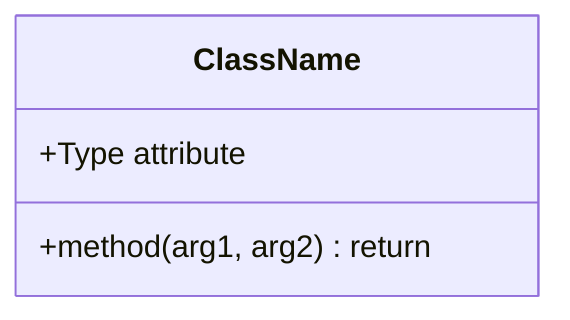
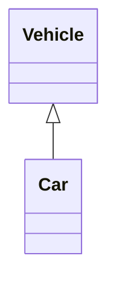
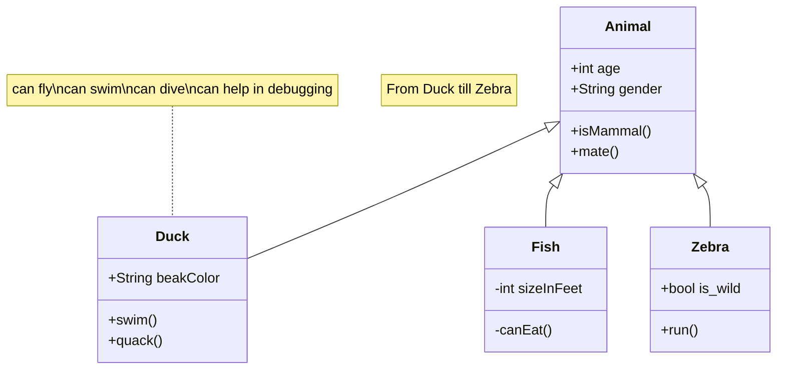

# Class diagrams
Refer: https://mermaid.js.org/syntax/classDiagram.html

The class diagram represents the classes and their relationships with UML notations.

## Class Members
UML provides how to represetn class members such as **attributes** and **methods**.
Mermaid distinguishes between attributes and functions/methods based on whether `()` are present or not.
```
classDiagram
class ClassName
    ClassName : +Type attribute
    ClassName : +method(arg1, arg2) return
```
Insetead of writing the class name every time, group members of a class using `{}` brackets.
```
classDiagram
class ClassName {
    +Type attribute
    +method(arg1, arg2) return
}
```

These two ways output the same diagram.



## Inheritance
When 'Vehicle' class inherits from 'Car' class, it is represented as follows:


## About
