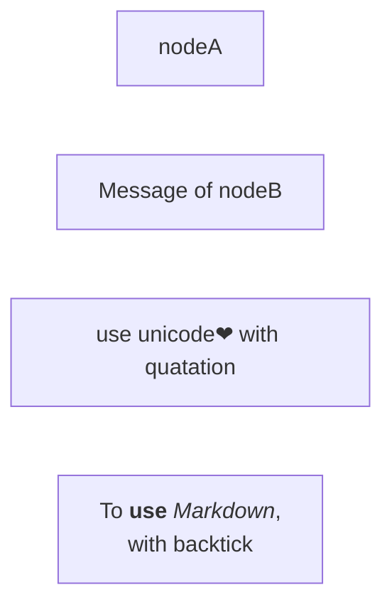
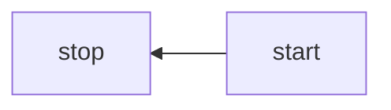
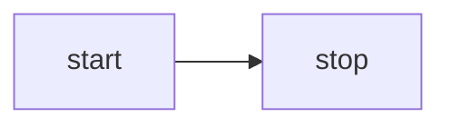
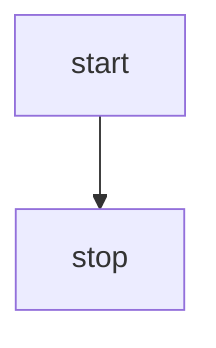
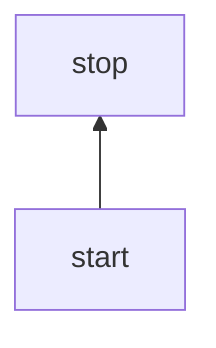
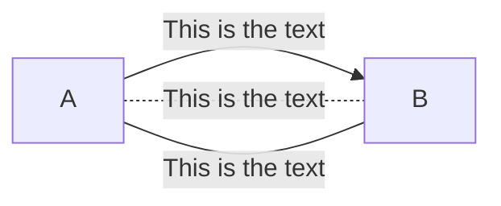
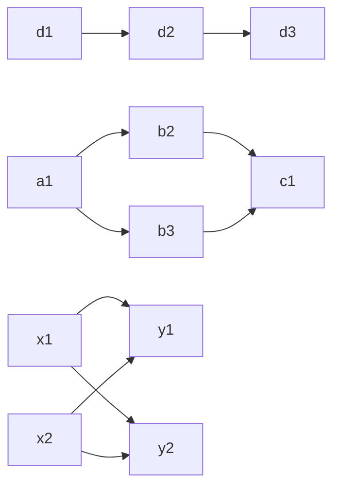
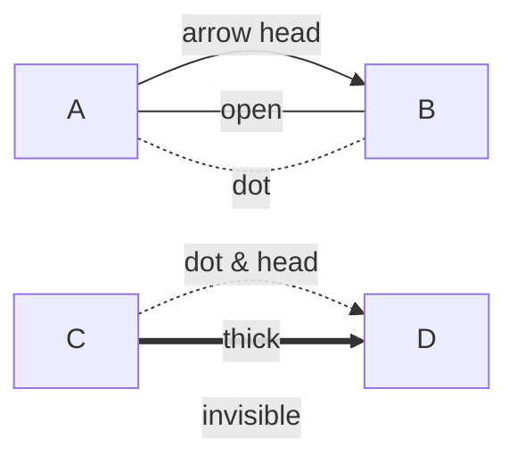

# Flowchart
Reference: https://mermaid.js.org/syntax/flowchart.html

Flowcharts are composed of nodes and edges. 
The Mermaid defines how nodes and edges are connected with different arrow types, and any linking to and from subgraphs.

WARNING: If you are typing the word "end" in a Flowchart node, it will break the Flowchart.
To avoid this, you can capitilize the entire word of any of the letters (e.g., "End" or "END").

## Nodes (default style)
```
flowchart LR
%% can use "graph" instead of "flowchart".
    nodeA
    nodeB[Message of nodeB]
    nodeC["To use unicode❤ with quatation "]
    nodeM["`To **use** _Markdown_, 
        with backtick`"]
```


## Edges
### Direction
```
flowchart LR
    %% use LR, RL, TB, BT
```





### Direction with text
```
flowchart LR
    A-- This is the text -->B
    A-. This is the text -.-B
    A---|This is the text|B
```


### Chaining of links


## Node Styles
### Node shapes
```
flowchart RL
    re(round edges)
    ss([stadium-shaped])
    sr[[subroutine]]
    cl[(database cylindrical)]
    cir((circle))
    cir2(((circle)))
    asym>asymmetric]
    rho{rhombus}
    hex{{hexagon}}
    para[/parallelogram/]
    para2[\parallelogram\]
    trape[/trapezoid\]
    trape2[\trapezoid/]
```


## Link Styles
### Link types
```
flowchart LR
    A-->|arrow head|B
    A---|open|B
    A-.-|dot|B
    C-.->|dot & head|D
    C==>|thick|D
    C~~~|invisible|D
```

