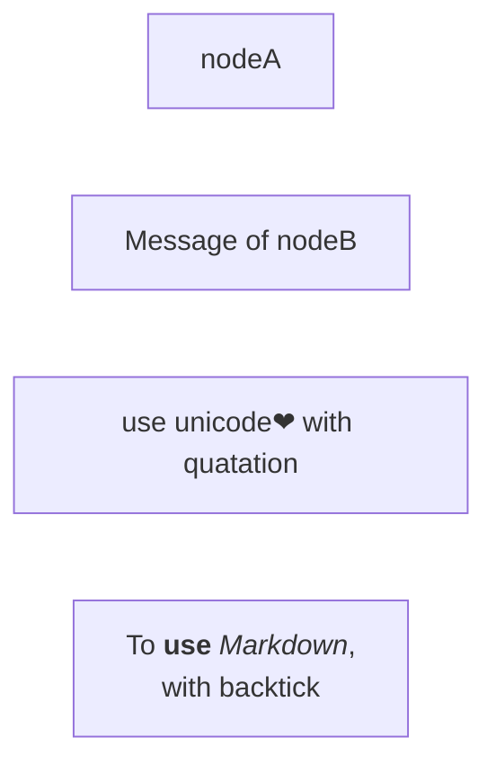
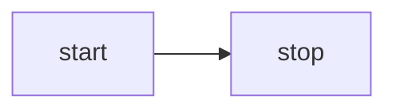

# Flowchart
Reference: https://mermaid.js.org/syntax/flowchart.html

Flowcharts are composed of nodes and edges. 
The Mermaid defines how nodes and edges are connected with different arrow types, and any linking to and from subgraphs.

WARNING: If you are typing the word "end" in a Flowchart node, it will break the Flowchart.
To avoid this, you can capitilize the entire word of any of the letters (e.g., "End" or "END").

## A node (default style)
```
flowchart LR
%% can use "graph" instead of "flowchart".
    nodeA
    nodeB[Message of nodeB]
    nodeC["To use unicode❤ with quatation "]
    nodeM["`To **use** _Markdown_, 
        with backtick`"]
```


## Direction
```
flowchart LR
%% can use LR, RL, TB, BT
    start --> stop
```


## Node Styles