# Flowchart
Reference: https://mermaid.js.org/syntax/flowchart.html

Flowcharts are composed of nodes and edges. 
The Mermaid defines how nodes and edges are connected with different arrow types, and any linking to and from subgraphs.

WARNING: If you are typing the word "end" in a Flowchart node, it will break the Flowchart.
To avoid this, you can capitilize the entire word of any of the letters (e.g., "End" or "END").

## Nodes 
### default style
In order to render special characters, put text within quotes.
```
flowchart LR
%% can use "graph" instead of "flowchart".
    nodeA
    nodeB[Message of nodeB]
    nodeC["To use unicode❤#9829; with quate#quot; "]
    nodeM["`To **use** _Markdown_, 
        with backtick`"]
```
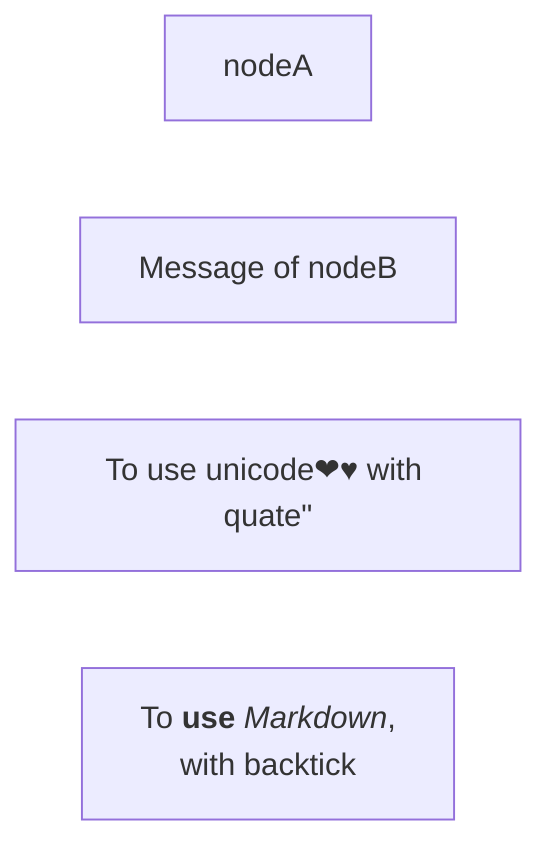

### Markdown Strings
The markdown format is supported in text with `"``"`.

In markdown strings, you can start new lines with  newline character instead of a `<br>` tag.

```
flowchart LR
subgraph "`**Sub Bold**`"
  a("`The **bold** 
  in *italic* hat`") -- "`**edge** label`" --> 
  b{{"`The **dog** in the hog`"}}
end
```
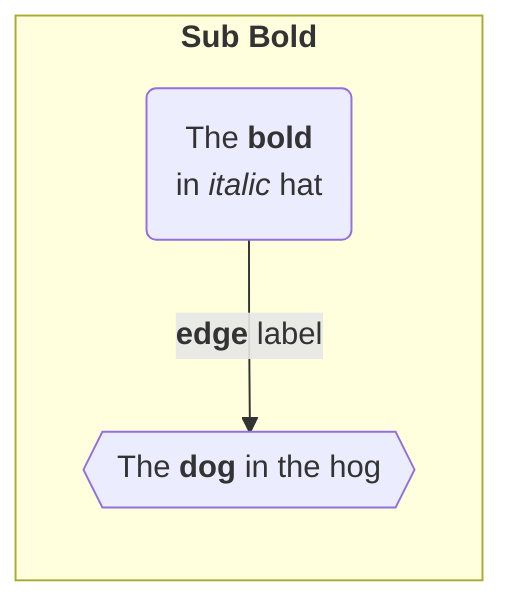


## Edges
### Direction
```
flowchart LR
    %% use LR, RL, TB, BT
```
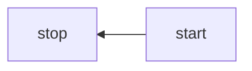
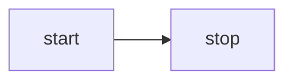
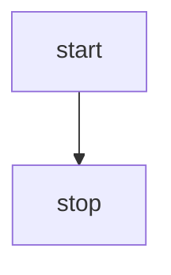
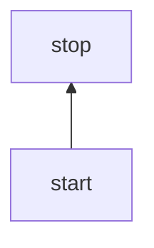

### Direction with text
```
flowchart LR
    A-- This is the text -->B
    A-. This is the text -.-B
    A---|This is the text|B
```
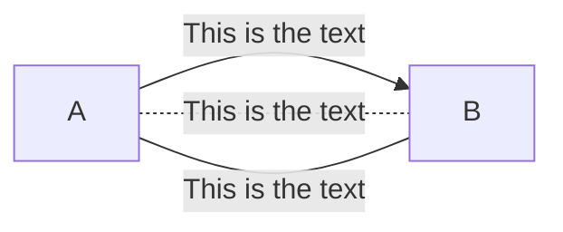

### Chaining of links
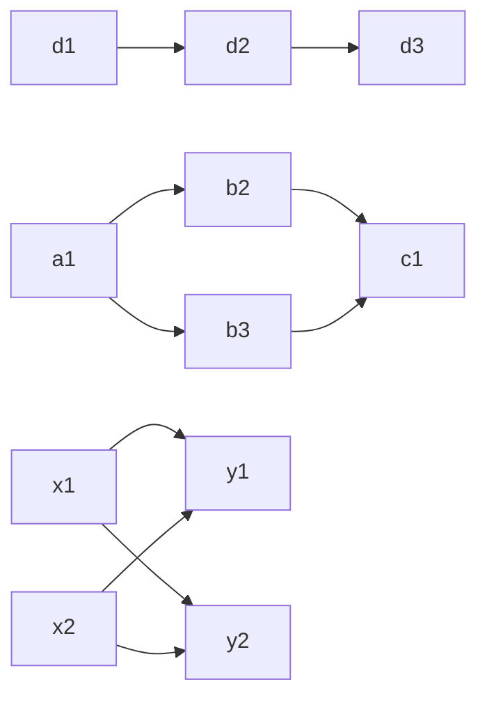

## Subgraphs
```
flowchart TB
    subgraph sub1[sub1]
        a1-->a2
    end
    subgraph sub2[sub2]
        b1
    end
    x2-->a2
    subgraph sub3
        c1---c2
    end
    c1-->a2
    sub1-->sub2
    sub2-->a2
```
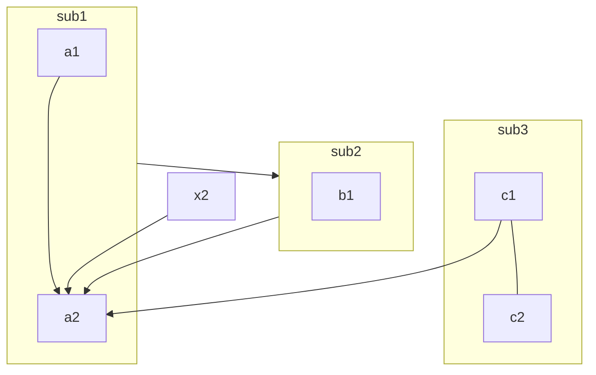

### Direction in subgraphs
WARN: If any of a subgraph's nodes are linked to the outside, subgraph direction will be ignored. The subgraph will inherit the direction of the parent graph by default.
```
flowchart LR
  subgraph TOP["TOP is LR"]
    direction LR
    subgraph B1["B1 is RL"]
        direction RL
        i1 -->f1
    end
    subgraph B2[B2 is BT]
        direction BT
        i2 -->f2
    end
    B1 --> B2
  end
  A --> TOP --> B
```
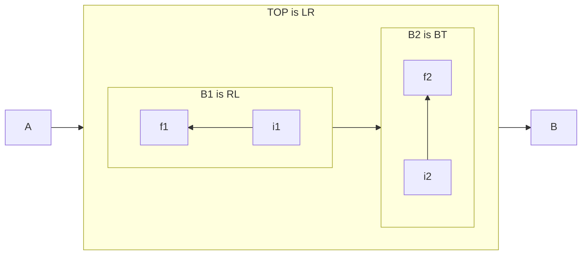


## Node Styles
### Node shapes
```
flowchart RL
    re(round edges)
    ss([stadium-shaped])
    sr[[subroutine]]
    cl[(database cylindrical)]
    cir((circle))
    cir2(((circle)))
    asym>asymmetric]
    rho{rhombus}
    hex{{hexagon}}
    para[/parallelogram/]
    para2[\parallelogram\]
    trape[/trapezoid\]
    trape2[\trapezoid/]
```
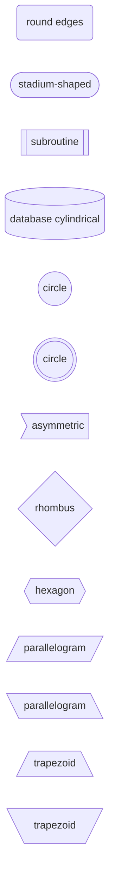

## Link Styles
### Link types
```
flowchart LR
    A-->|arrow head|B
    A---|open|B
    A-.-|dot|B
    C-.->|dot & head|D
    C==>|thick|D
    C~~~|invisible|D
    E--oF
    E--xF
```
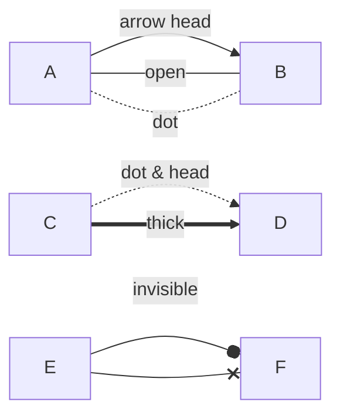

### Multi directional arrows
```
flowchart LR
    A<-->|arrow head|B
    C<-.->|dot & head|D
    C<==>|thick|D
    E o--oF
    E x--xF
```
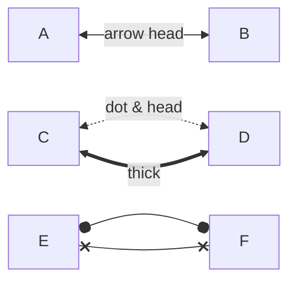

### Lengeh of links
You can make any link longer by adding more dashes in the link.

NOTE: The acutla length of the link is determined by the rendering engine automatically.
```
flowchart LR
    S -->A -->|d:2|B --> C
    S -->dash:2
    S ---> dash:3
    S ----> dash:4
    S -...-> dot:3
    S -----> dash:5
```
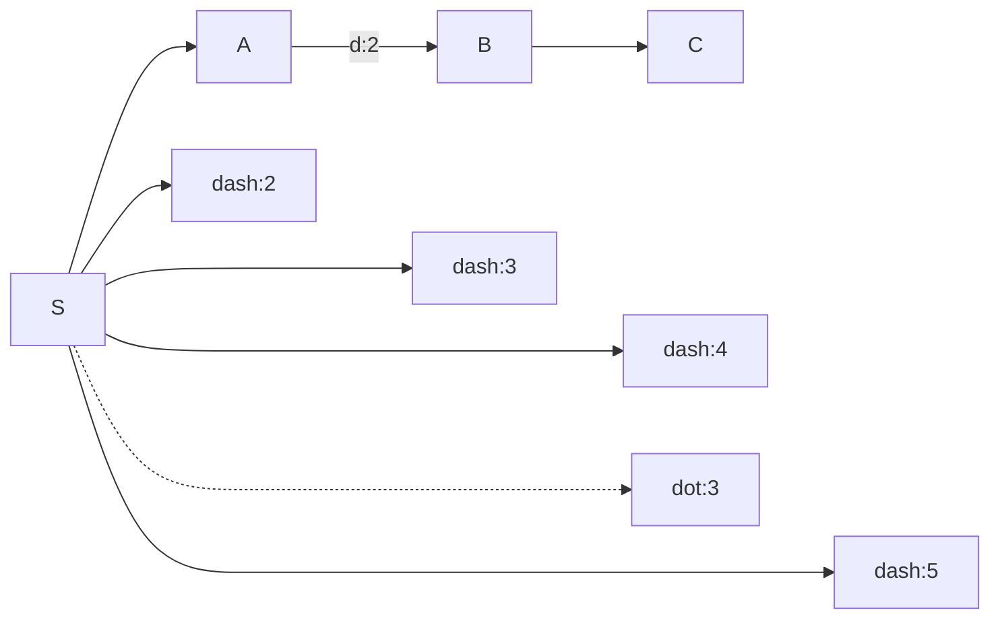

## Special Characters