# Flowchart

Reference: https://mermaid.js.org/syntax/flowchart.html

Flowcharts are composed of nodes and edges.
The Mermaid defines how nodes and edges are connected with different arrow types, and any linking to and from subgraphs.

WARNING: If you are typing the word "end" in a Flowchart node, it will break the Flowchart.
To avoid this, you can capitilize the entire word of any of the letters (e.g., "End" or "END").

## Nodes

### default style

In order to render special characters, put text within quotes.

```
flowchart LR
%% can use "graph" instead of "flowchart".
    nodeA
    nodeB[Message of nodeB]
    nodeC["To use unicode❤#9829; with quate#quot; "]
    nodeM["`To **use** _Markdown_,
        with backtick`"]
```

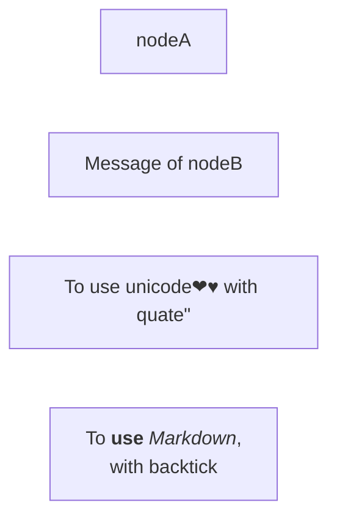

### Markdown Strings

The markdown format is supported in text with ` "``" `.

In markdown strings, you can start new lines with newline character instead of a `<br>` tag.

```
flowchart LR
subgraph "`**Sub Bold**`"
  a("`The **bold**
  in *italic* hat`") -- "`**edge** label`" -->
  b{{"`The **dog** in the hog`"}}
end
```

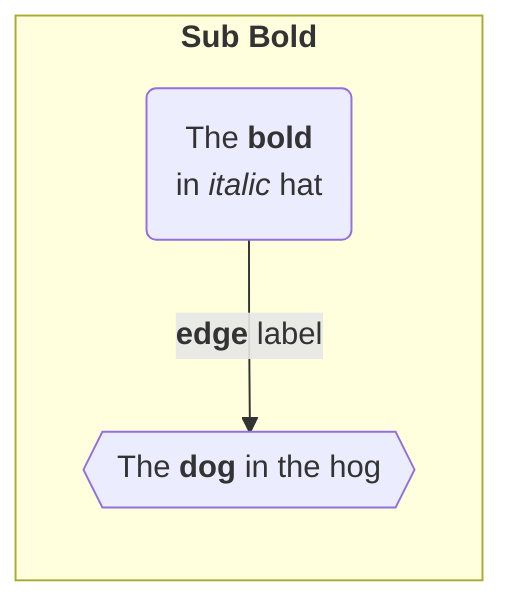

## Edges

### Direction

```
flowchart LR
    %% use LR, RL, TB, BT
```

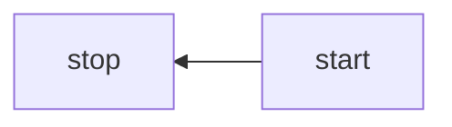

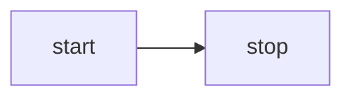

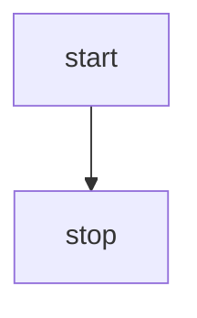

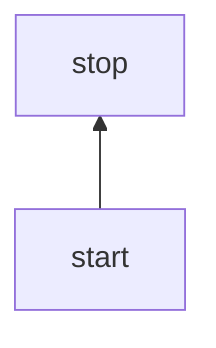

### Direction with text

```
flowchart LR
    A-- This is the text -->B
    A-. This is the text -.-B
    A---|This is the text|B
```

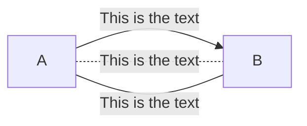

### Chaining of links

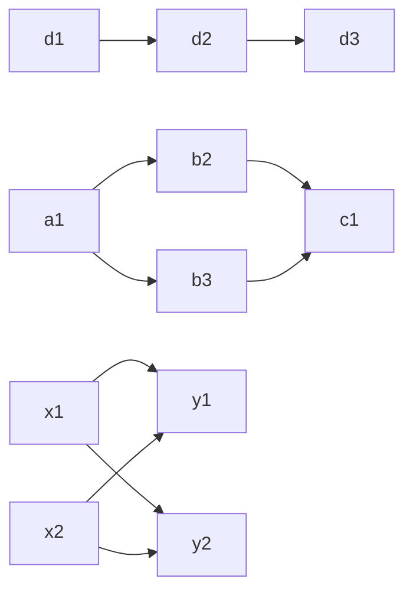

## Subgraphs

```
flowchart TB
    subgraph sub1[sub1]
        a1-->a2
    end
    subgraph sub2[sub2]
        b1
    end
    x2-->a2
    subgraph sub3
        c1---c2
    end
    c1-->a2
    sub1-->sub2
    sub2-->a2
```

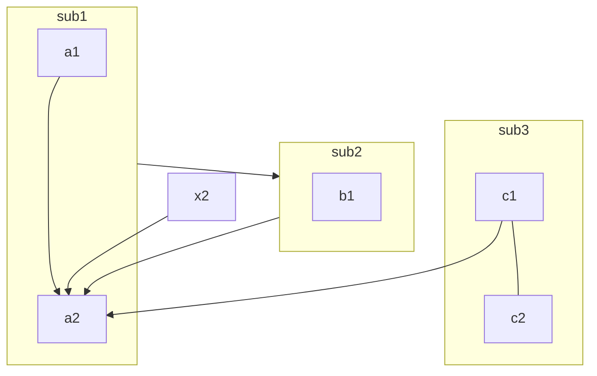

### Direction in subgraphs

WARN: If any of a subgraph's nodes are linked to the outside, subgraph direction will be ignored. The subgraph will inherit the direction of the parent graph by default.

```
flowchart LR
  subgraph TOP["TOP is LR"]
    direction LR
    subgraph B1["B1 is RL"]
        direction RL
        i1 -->f1
    end
    subgraph B2[B2 is BT]
        direction BT
        i2 -->f2
    end
    B1 --> B2
  end
  A --> TOP --> B
```

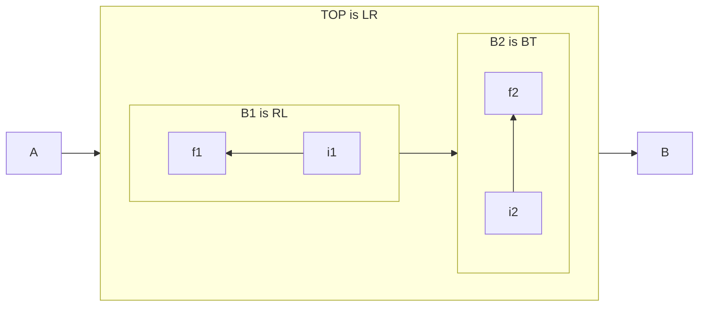

## Comments

Comments must be started with `%%` and can be placed anywhere in the diagram.

## Node Styles

### Node shapes

```
flowchart RL
    re(round edges)
    ss([stadium-shaped])
    sr[[subroutine]]
    cl[(database cylindrical)]
    cir((circle))
    cir2(((circle)))
    asym>asymmetric]
    rho{rhombus}
    hex{{hexagon}}
    para[/parallelogram/]
    para2[\parallelogram\]
    trape[/trapezoid\]
    trape2[\trapezoid/]
```


### Styling a node

```
flowchart LR
    id1(Start)-->id2(Stop)
    style id1 fill:#f9f,stroke:#333,stroke-width:4px
    style id2 fill:#bbf,stroke:#f66,stroke-width:2px,color:#fff,stroke-dasharray: 5 5
```

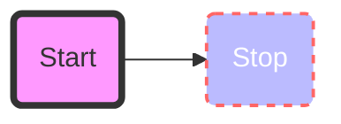

```
flowchart LR
    A:::foo & B:::bar --> C:::foobar
    %% define style classes
    classDef foo fill:#f96
    classDef bar stroke:#0f0
    classDef foobar stroke:#00f
```

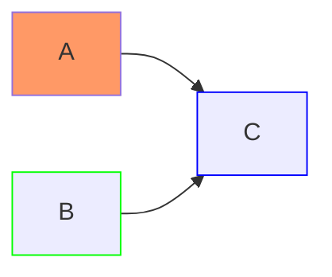

### CSS classes

It is also possible to predefine classes in CSS styles that can be applied from the graph definition.

```html
<style>
  .cssClass > rect {
    fill: #ff0000;
    stroke: #ffff00;
    stroke-width: 4px;
  }
</style>
```

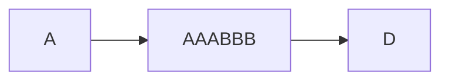

### Basic support for fontawesome

[Font Awesome](https://fontawesome.com/) is a popular icon set. 
Mermaid does not have any restriction on the version of Font Awesome that can be used.
Please refer the [Official Font Awesome Documentation](https://fontawesome.com/start) on how to include it.

```html
<link
  href="https://cdnjs.cloudflare.com/ajax/libs/font-awesome/6.5.1/css/all.min.css"
  rel="stylesheet"
/>
```
```
flowchart TD
    B["fa:fa-twitter for peace"]
    B-->C[fa:fa-ban forbidden]
    B-->D(fa:fa-spinner)
    B-->E(A fa:fa-camera-retro perhaps?)
```


## Link Styles

### Link types

```
flowchart LR
    A-->|arrow head|B
    A---|open|B
    A-.-|dot|B
    C-.->|dot & head|D
    C==>|thick|D
    C~~~|invisible|D
    E--oF
    E--xF
```

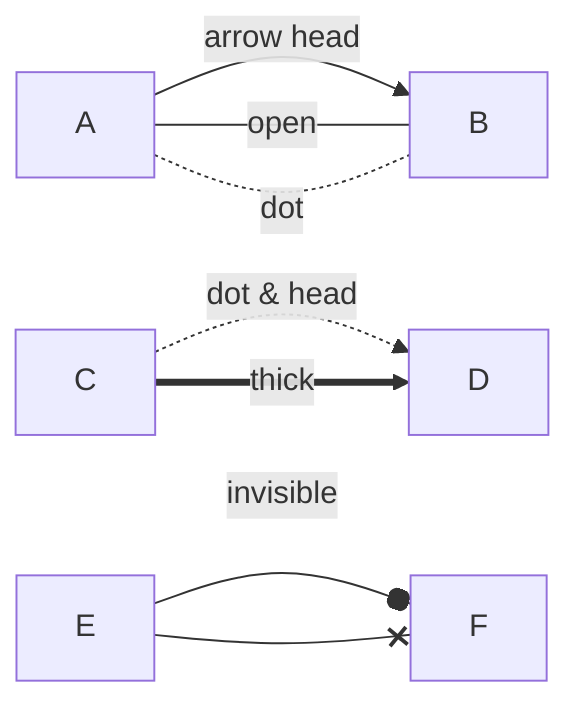

### Multi directional arrows

```
flowchart LR
    A<-->|arrow head|B
    C<-.->|dot & head|D
    C<==>|thick|D
    E o--oF
    E x--xF
```

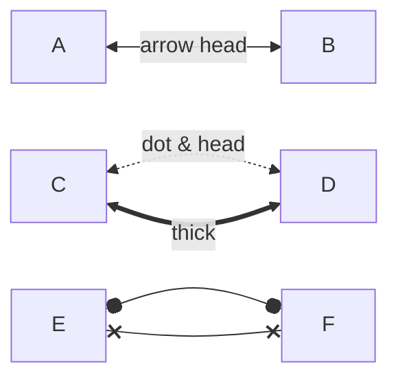

### Lengeh of links

You can make any link longer by adding more dashes in the link.

NOTE: The acutla length of the link is determined by the rendering engine automatically.

```
flowchart LR
    S -->A -->|d:2|B --> C
    S -->dash:2
    S ---> dash:3
    S ----> dash:4
    S -...-> dot:3
    S -----> dash:5
```

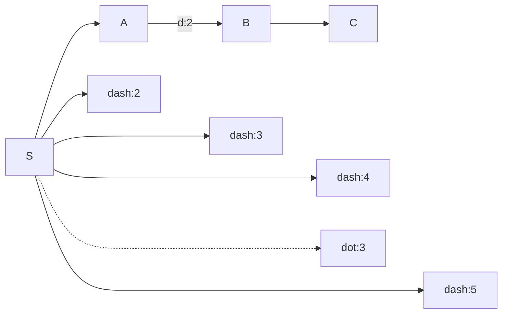

### Styling links

https://mermaid.js.org/syntax/flowchart.html#styling-links
As links have no ids in the same way as nodes, some other way of deciding what style the links should be attached to is required.
Instead of ids, the order number of when the link was defined in the graph is used, or use default to apply to all links.
In the example below the style defined in the linkStyle statement will belong to the fourth link in the graph:

```html
linkStyle 1,2,7 stroke:#ff3,stroke-width:4px,color:red;
```

### Styling line curves

It is possible to style the type of curve used for lines between items.
Available curve styles include basis, bumpX, bumpY, cardinal, catmullRom, linear, monotoneX, monotoneY, natural, step, stepAfter, and stepBefore.

```html
%%{ init: { 'flowchart': { 'curve': 'stepBefore' } } }%% graph LR
```

For a full list of available curves, including an explanation of custom curves, refer to the [Shapes](https://github.com/d3/d3-shape/blob/main/README.md#curves) documentation in the [d3-shape](https://github.com/d3/d3-shape/) project.

## Interaction

It is possible to bind a click event to a node.
Click events can be used to trigger javascript callbacks or to open URLs.

```html
<body>
  <pre class="mermaid">
    flowchart LR
        A-->B
        B-->C
        C-->D
        click A callback "Tooltip"
        click B "https://www.github.com" "This is a link"
        click C call callback() "Tooltip"
        click D href "https://www.github.com" "This is a link"
  </pre>

  <script>
    const callback = function () {
      alert("A callback was triggered");
    };
    const config = {
      startOnLoad: true,
      flowchart: { useMaxWidth: true, htmlLabels: true, curve: "cardinal" },
      securityLevel: "loose",
    };
    mermaid.initialize(config);
  </script>
</body>
```

## Configuration

### Renderer

The default renderer of Mermaid is [darge](https://github.com/dagrejs/dagre).
In Mermaid version 9.4 later, you can use *elk* as an alternate renderer.
The *elk* renderer is more suitable for rendering larger and/or more complex diagrams. 
(The *elk* renderer is an experimental feature.)

```html
%%{init: {"flowchart": {"defaultRenderer": "elk"}} }%%
```

### Width

In order to change the width of the rendered flowchart, define `mermaid.flowchartConfig` in the configuration.
`mermaid.flowchartConfig` can be set to a JSON string with config parmeters or the corresponding object.
How to use the CLI is described in the mermaidCLI page.

```js
mermaid.flowchartConfig = {
    width: 100%
}
```