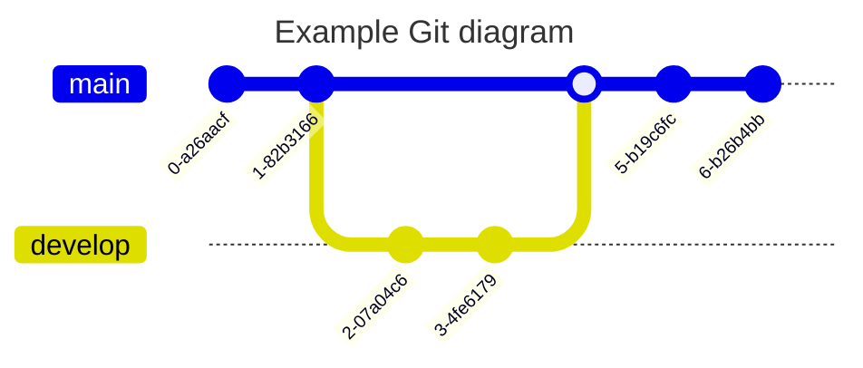

# Gitgraph Diagrams

Reference: https://mermaid.js.org/syntax/gitgraph.html

A Git Graph represents the commit history of a Git repository.
These kind of diagram makes it easier to visualize how git flow works
and helps developers and devops teams share their Git branching strategies.

Mermaid supports the basic git operations like commit, checkout, merge, etc.

## Syntax
